# 目的

大概就是为了打开电脑后，懒得手动打开常用软件，让电脑先跑一会儿......

# 定义几个概念

**计划**：一组程序

**程序**：想让电脑启动的应用等等

**操作**：启动应用后执行的一些简单的、有序的操作，比如鼠标点击、快捷键触发

**最大等待时间**：程序点击启动后到开始执行操作的最大等待时间，0(表示默认15秒)。

**操作间隔**：前一个操作开始执行到后一个操作开始执行的时间差，默认1.5秒

**【】**：标明操作目标。例如：【程序】

**「」**:标明操作方式。例如：「双击」

# 操作一波

1. 添加计划：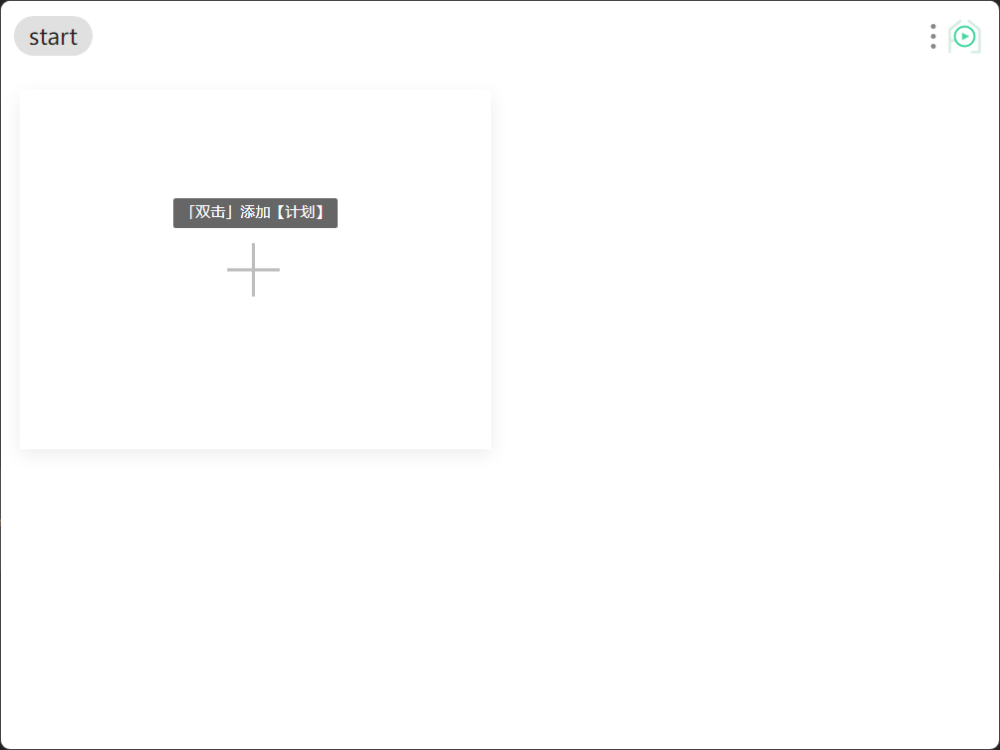
2. 添加程序：可添加exe、sh后缀的程序或者程序快捷方式。(注意：sh程序可能会一直运行在后台)
   1. 拖拽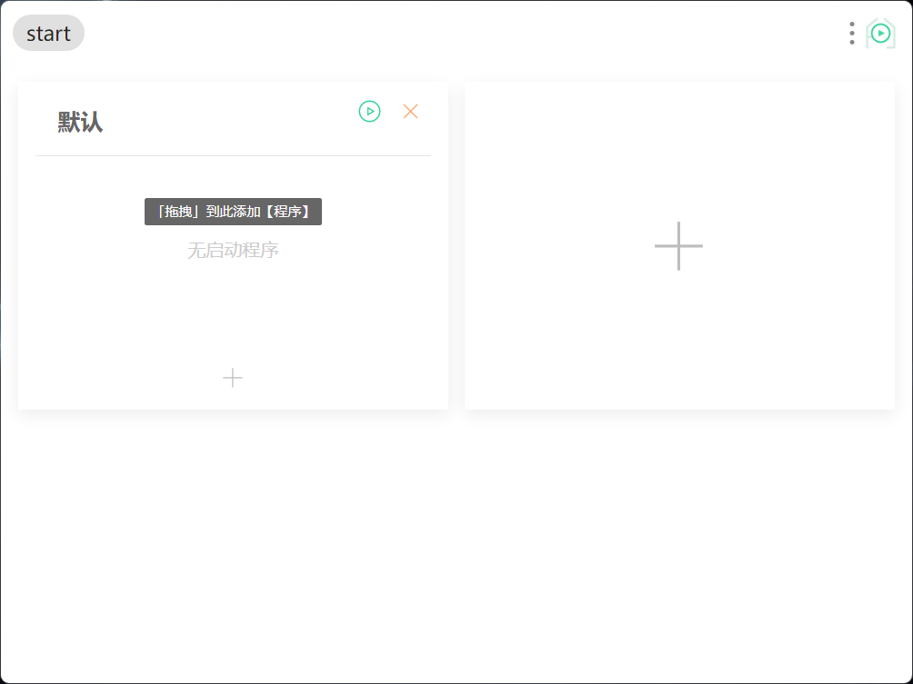
   2. 点击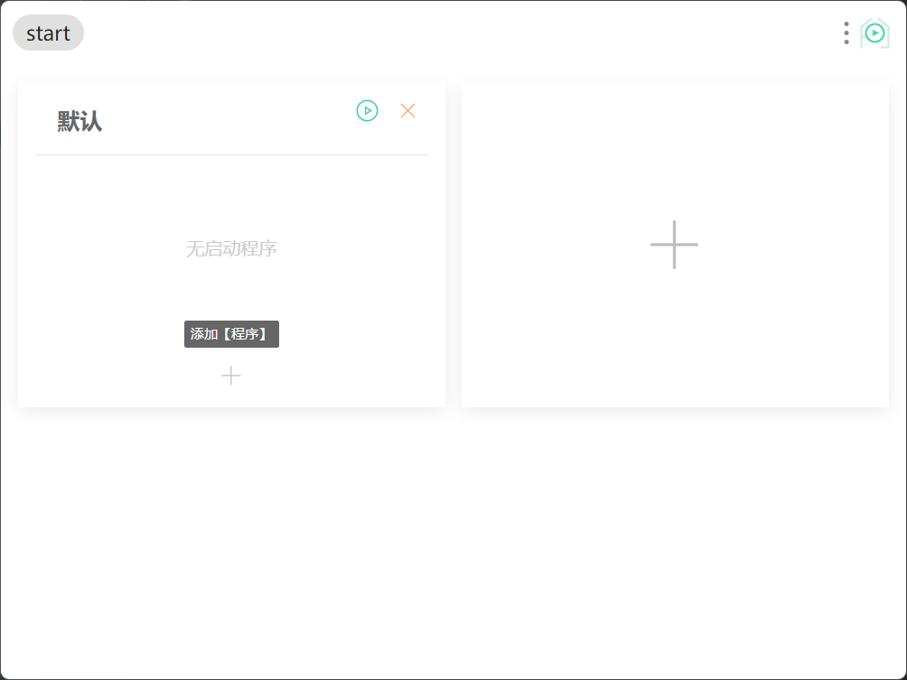
3. 启动程序
   1. 添加后启动
   2. 直接启动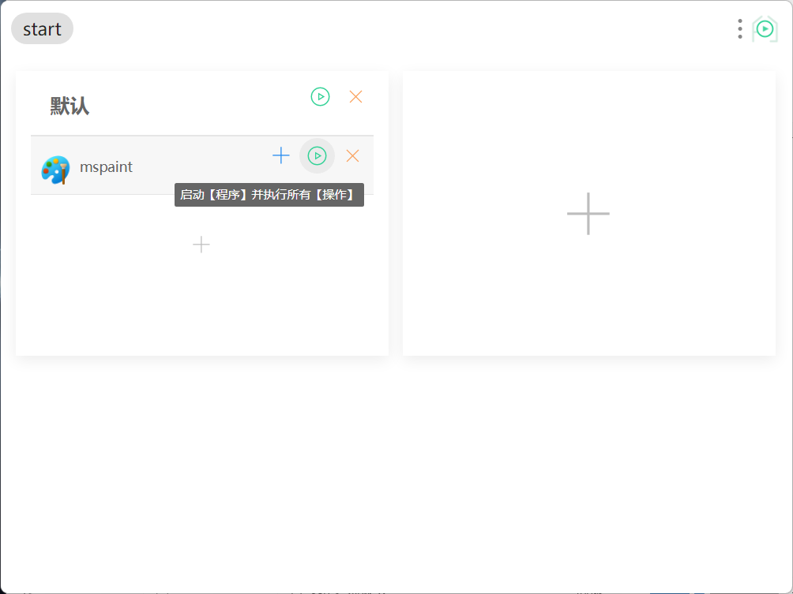
4. 添加操作：
   1. 鼠标点击操作(蓝底)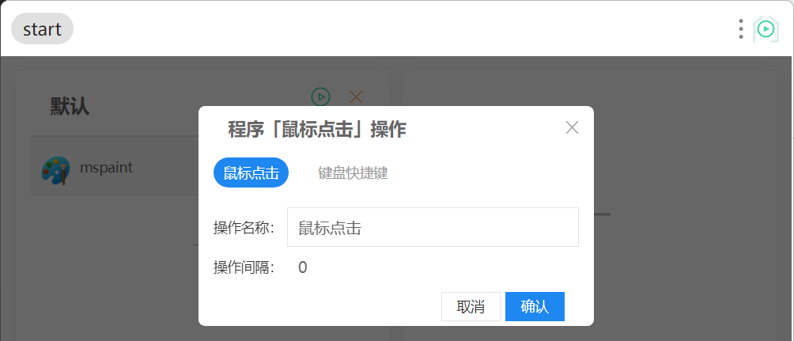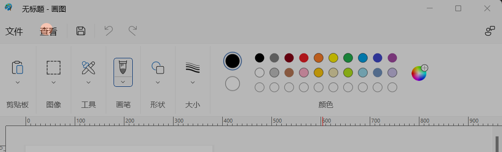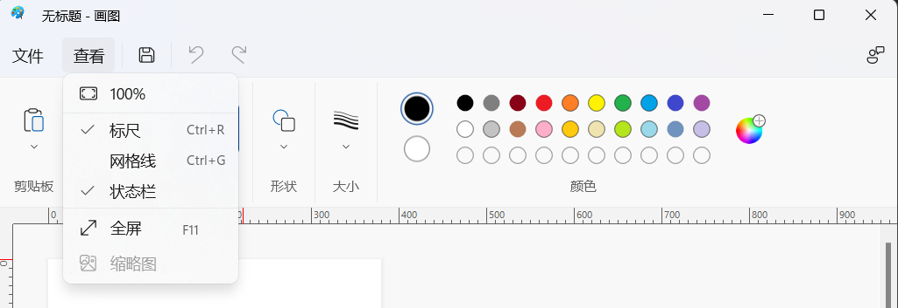
   2. 键盘快捷键操作(绿底)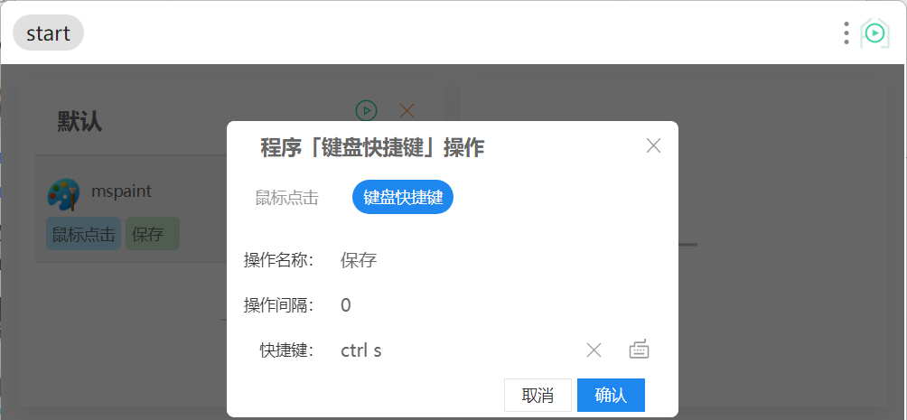
   3. 结果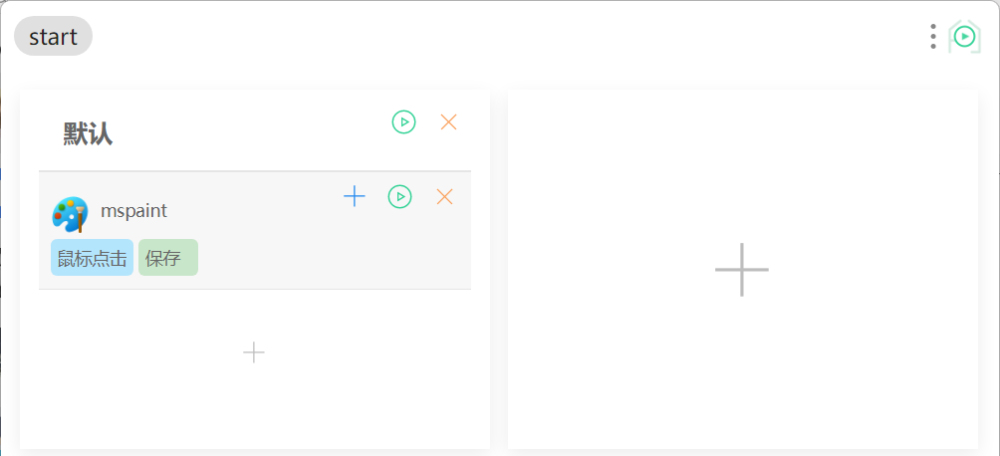
5. 启动程序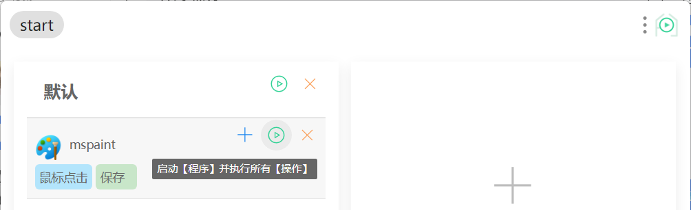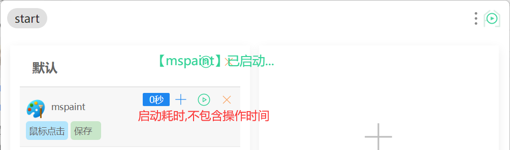
6. 启动计划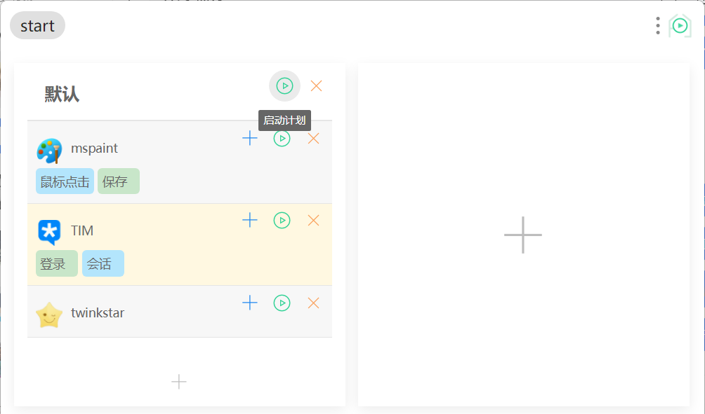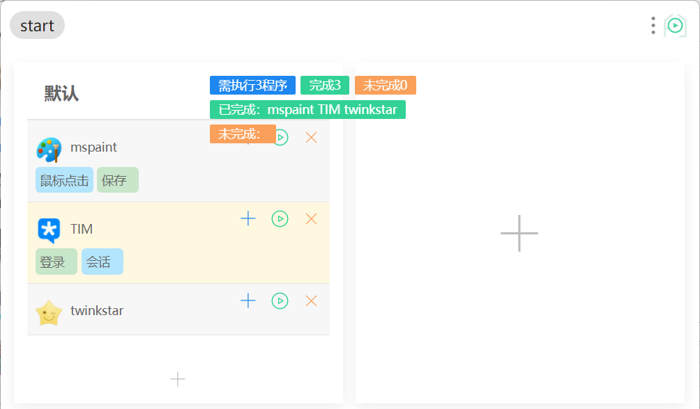
7. 其他操作

- 修改名称：直接在名称上进行修改
  - 计划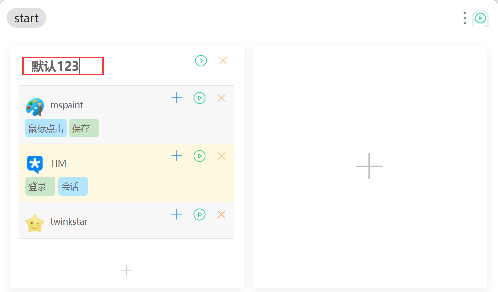
  - 程序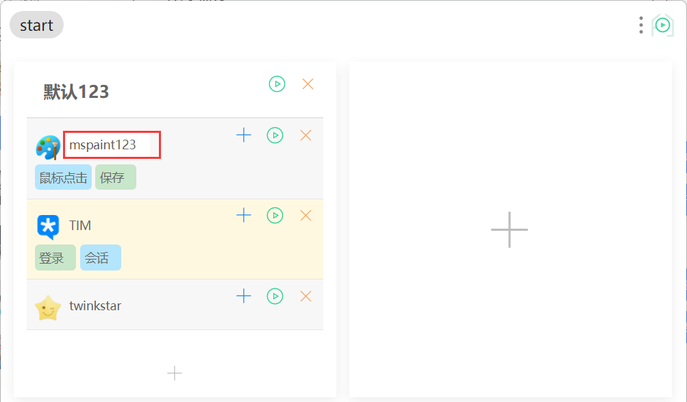
  - 操作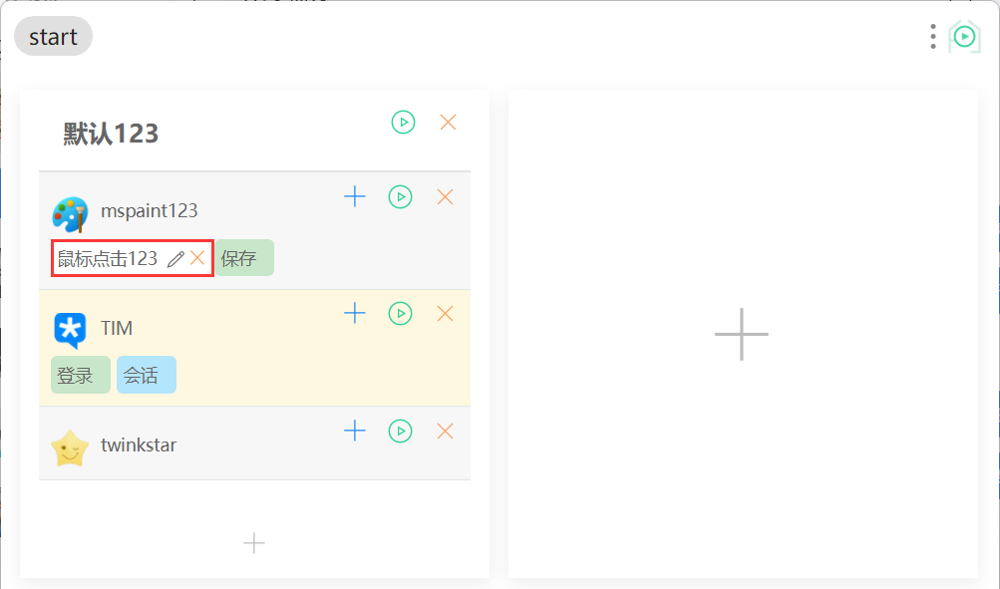
- 删除操作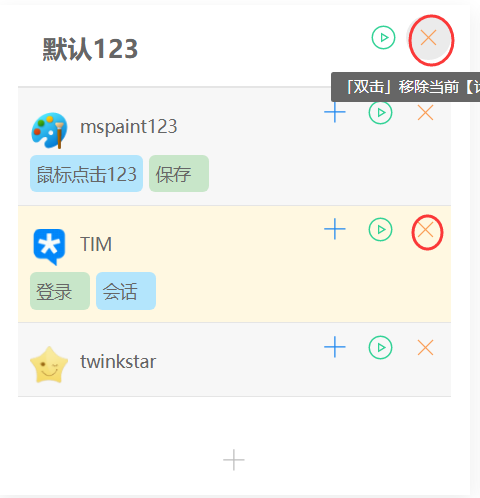
- 配置与禁止启动
  - 配置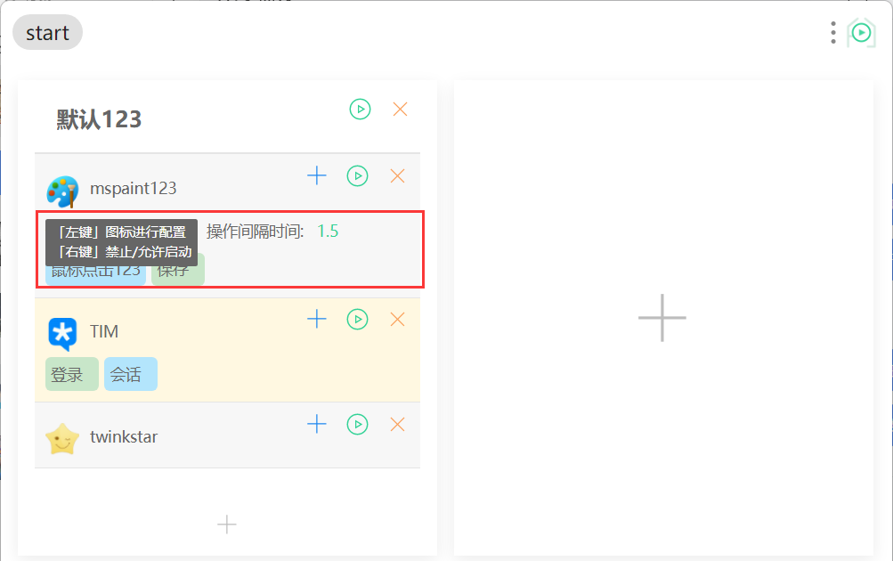
  - 禁止/恢复启动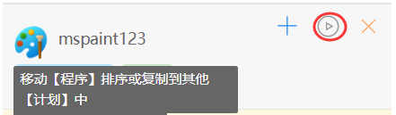
- 修改和删除操作
  - 修改
  - 删除
- 拖拽程序进行排序