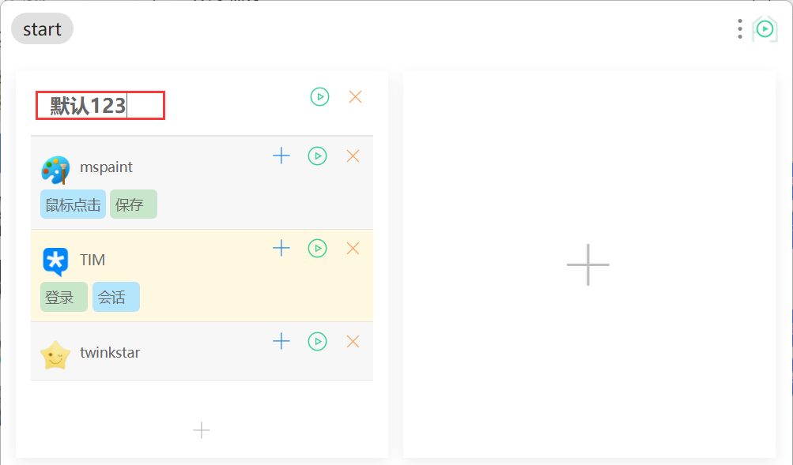

# 目的

大概就是为了打开电脑后，懒得手动打开常用软件，让电脑先跑一会儿......

# 定义几个概念

**计划**：一组程序

**程序**：想让电脑启动的应用等等

**操作**：启动应用后执行的一些简单的、有序的操作，比如鼠标点击、快捷键触发

**最大等待时间**：程序点击启动后到开始执行操作的最大等待时间，0(表示默认15秒)。

**操作间隔**：前一个操作开始执行到后一个操作开始执行的时间差，默认1.5秒

**键入文本**：将该操作的文本内容复制并执行拷贝

**【】**：标明操作目标。例如：【程序】

**「」**:标明操作方式。例如：「双击」

# 操作一波

1. 添加计划：

   
2. 添加程序：可添加exe、sh后缀的程序或者程序快捷方式。(注意：sh程序可能会一直运行在后台)
    1. 拖拽

       
    2. 点击

       
3. 添加操作：
    1. 鼠标点击操作(蓝底)

       

       

       
    2. 键盘快捷键操作(绿底)

       
    3. 键入文本操作(红底)

       
    4. 结果

       
4. 启动程序
    1. 添加程序后启动
    2. 带操作启动：启动按钮有绿色边框

       
    3. 无操作启动：启动按钮无绿色边框

       
    4. 结果

   
5. 启动计划

   

   
6. 其他操作

- 修改名称：直接在名称上进行修改
    - 计划

      
    - 程序

      
    - 操作

      
- 删除操作

  
- 配置与禁止启动
    - 配置

      
    - 禁止/恢复启动

      

      
- 修改和删除操作
    - 修改

      
    - 删除

      
- 单个计划中拖拽程序排序
- 两个计划间拖拽复制程序
- 禁用/允许执行操作
    - 允许：带圈表示执行操作启动

      
    - 禁用：不带圈表示无操作启动

      
- 修改操作完成后可以直接在该操作后直接追加新操作

7. 问题反馈

- 错误日志

  

  
- TIM

  

# 常见问题

- 如果遇到某些程序操作未执行，可以尝试使用管理员权限启动 uTools
